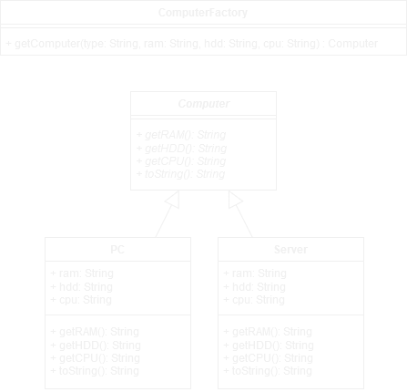

# **Design Patterns**

> Design patterns are reusable solutions to common software design problems. They provide templates or blueprints for structuring code in a way that promotes scalability, maintainability, and flexibility. These patterns encapsulate best practices and principles of object-oriented design, making it easier for developers to communicate and collaborate effectively. [_chatGPT_](https://chat.openai.com/)

# Architectural Design Patterns

## 1.1 Factory Pattern

The Factory Pattern provides an interface or method to create objects in a superclass but allows subclasses to alter the type of objects that will be created. This pattern decouples the object creation process from the client.

<table style="width: 100%;">
    <tr>
        <th style="text-align:center; width:50%">Advantages</th>
        <th style="text-align:center; width:50%">Disadvantages</th>
    </tr>
    <tr>
        <td align="center">Reusable</td>
        <td align="center">Increased code complexity</td>
    </tr>
    <tr>
        <td align="center">Flexible</td>
        <td align="center">More subclasses</td>
    </tr>
    <tr>
        <td align="center">Single Responsibility Principle</td>
        <td align="center"></td>
    </tr>
        <tr>
        <td align="center">Open/Closed Principle</td>
        <td align="center"></td>
    </tr>
</table>

### Structure

-   **Product Interface**: Abstract class to ensure a consistent interface for all product types

-   **Concrete Products**: Represents the actual objects

-   **Factory Interface**: Declares the creation methods

-   **Concrete Factories**: Implementation of creation logic for different Product types.

### Example

 

## 1.2 Abstract Factory Pattern

The Abstract Factory Pattern provides an interface for creating families of related/dependent object without specifying their concrete classes. It allows a system to use multiple "families" of objects interchangeably by encapsulating the creation logic in factory classes.

<table style="width: 100%;">
    <tr>
        <th style="text-align:center; width:50%">Advantages</th>
        <th style="text-align:center; width:50%">Disadvantages</th>
    </tr>
    <tr>
        <td align="center">Flexibility/ Encapsulation/Scalability</td>
        <td align="center">Too many products/factories can make the codebase difficult to manage</td>
    </tr>
    <tr>
        <td align="center">Single Responsibility Principle</td>
        <td align="center">May introduce additional layers of abstraction when simpler solutions might suffice for smaller applications.</td>
    </tr>
    <tr>
        <td align="center">Open/Closed Principle</td>
        <td align="center"></td>
    </tr>
</table>

### Structure

-   **Abstract Factory**: Declares methods for creating abstract producs

-   **Concrete Factory**: Implements creation methods for specific families of producs

-   **Abstract Product**: Declares an interface for a type of product

-   **Concrete Product**: Implements the product interface and defines the behavior for the specific product.

### Example

-   Factory.java is the abstract factory and declares the methods for the concrete factory

-   FactoryMac.java and FactoryWin.java serves as the concrete factories

-   Button.java and Checkbox.java are abstract products declaring the methods for an concrete product

-   ButtonMac.java, ButtonWin.java, CheckboxMac.java and CHeckboxWin.java are the concrete products defining the behavior

-   Application.java uses the concrete products to build an UI

 

## 1.3 Prototype Pattern

The Prototype Pattern is used to create new objects by copying/cloning an existing object (prototype). The new object is created as a clone of the prototype. It is useful when creating an object from scratch is resource-intensive or complex.

<table style="width: 100%;">
    <tr>
        <th style="text-align:center; width:50%">Advantages</th>
        <th style="text-align:center; width:50%">Disadvantages</th>
    </tr>
    <tr>
        <td align="center">Reduces the cost of object creation</td>
        <td align="center">Requires careful implementation of cloning</td>
    </tr>
    <tr>
        <td align="center">Simplifies object creation for complex systems</td>
        <td align="center">Unintended consequences if mutable objects within the prototype are not handled properly</td>
    </tr>
    <tr>
        <td align="center">Helps avoid subclass proliferation by reusing existing objects</td>
        <td align="center"></td>
    </tr>
</table>

### Structure

-   **Prototype Interface**: Defines clone() method

-   **Concrete Prototype**: Implements the prototype interface

### Example

-   The Shape.java class is the Prototype Interface. It defines the Shape and the clone() method

-   Circle.java and Rectangle.java are concrete implementations of Shape

 

## 1.4 Builder Pattern

The Builder Pattern simplifies the creation of complex objects. It is particularly useful when an object is composed of multiple components or requires various configurations to suit different use cases.

<table style="width: 100%;">
    <tr>
        <th style="text-align:center; width:50%">Advantages</th>
        <th style="text-align:center; width:50%">Disadvantages</th>
    </tr>
    <tr>
        <td align="center">Construct objects step-by-step</td>
        <td align="center">Code complexity increases</td>
    </tr>
    <tr>
        <td align="center">Reuse construction code</td>
        <td align="center"></td>
    </tr>
    <tr>
        <td align="center">Single Responsibility Principle</td>
        <td align="center"></td>
    </tr>
</table>

### Structure

-   **Builder**: Defines an interface with methods to build the object step by step

-   **Concrete Builder**: A specific implementation of the Builder interface that assembles and constructs the object

-   **Director**: Oversees and controls the building process

-   **Product**: Final object that is created by the Builder

### Example

-   The Builder.java interface defines the methods required to construct an object

-   The ComputerBuilder.java class serves as the concrete builder, implementing the Builder interface

-   The Director.java class orchestrates the building process

-   The Computer.java class represents the product

 

## 1.5 Singelton Pattern (DON'T)

The Singleton Pattern ensures that a class has only one instance, while providing a global access point to this instance. **Don't use it, many drawbacks!**

<table style="width: 100%;">
    <tr>
        <th style="text-align:center; width:50%">Advantages</th>
        <th style="text-align:center; width:50%">Disadvantages</th>
    </tr>
    <tr>
        <td align="center">Class has only a single instance</td>
        <td align="center">Violates Single Responsibility Principle</td>
    </tr>
    <tr>
        <td align="center">Gain global acces point to that instance</td>
        <td align="center">Can mask bad design, when components know too much about each other</td>
    </tr>
    <tr>
        <td align="center">Singleton object is initialized only when it's requested for the first time</td>
        <td align="center">Needs special treatment in multithreaded environments that theads won't create a singleton object several times</td>
    </tr>
        <tr>
        <td align="center"></td>
        <td align="center">May be difficult to unit test</td>
    </tr>
</table>

### Structure

-   **Singleton class**: Declares static method getInstance() that return the same instance of its own class. The constructor should be hidden from client code -> getInstance() should be the only way of getting the Singleton object.

### Example

-   The Singleton.java class implements the static method getInstance() which can be used in client code

 

# Structural Design Patterns

### 2.1 Adapter Pattern

### 2.2 Decorator Pattern

### 2.3 Proxy Pattern

### 2.4 Composite Pattern

### 2.5 Bridge Pattern

### 2.6 Facade Pattern

### 2.7 Flyweight (Anti) Pattern

## Behavioral Design Patterns

### 3.1 Template Method

### 3.2 Strategy Pattern

### 3.3 Null Object Pattern

### 3.4 Command Pattern

### 3.5 Observer Pattern

### 3.6 Visitor Pattern

### 3.7 State Pattern

### 3.8 Iterator Pattern
